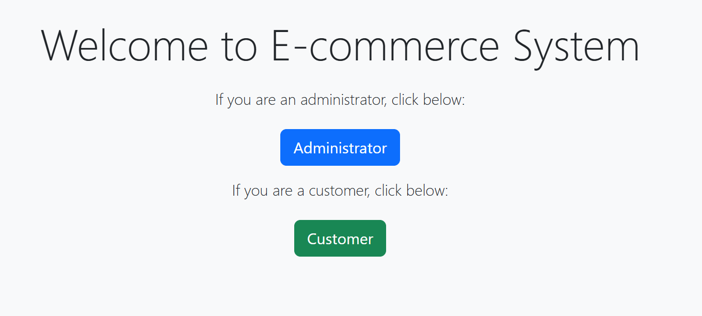
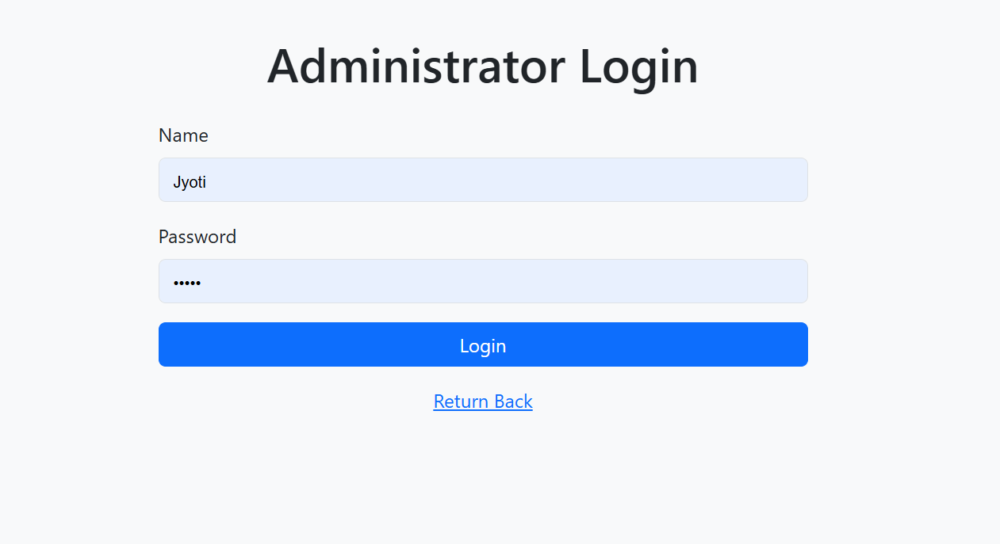
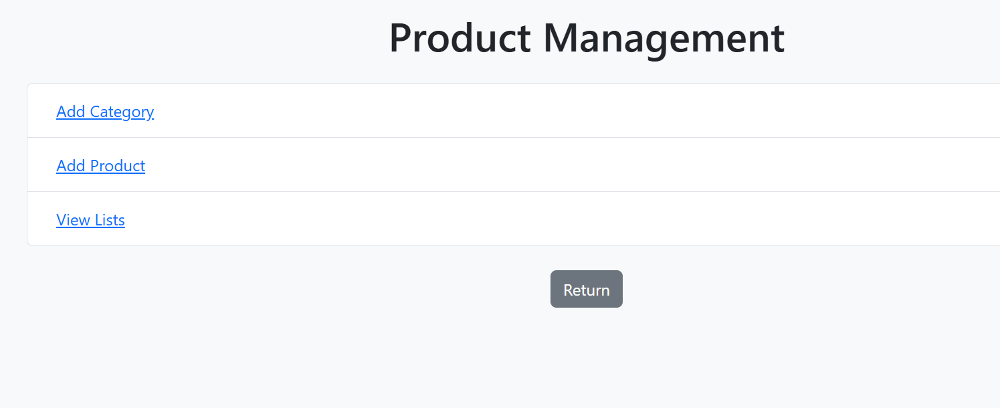
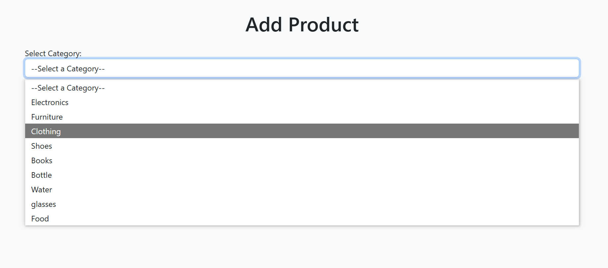
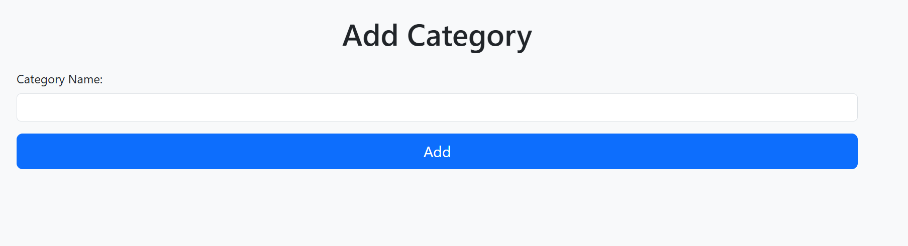
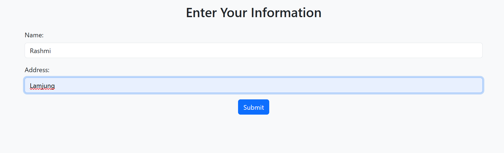
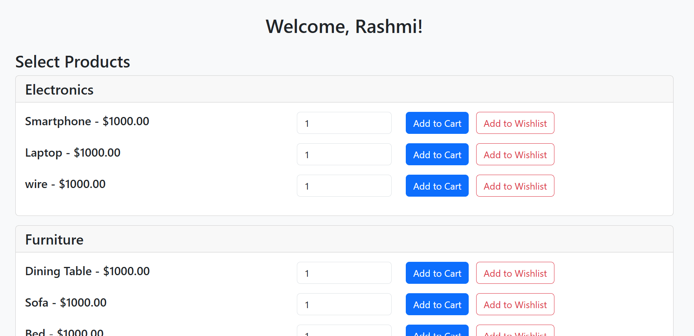
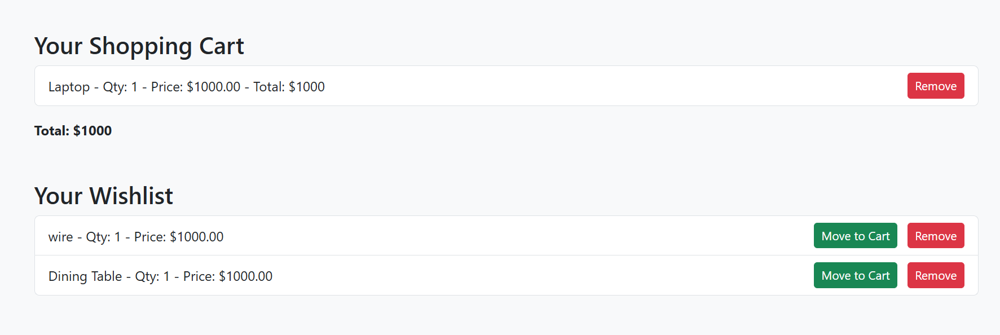
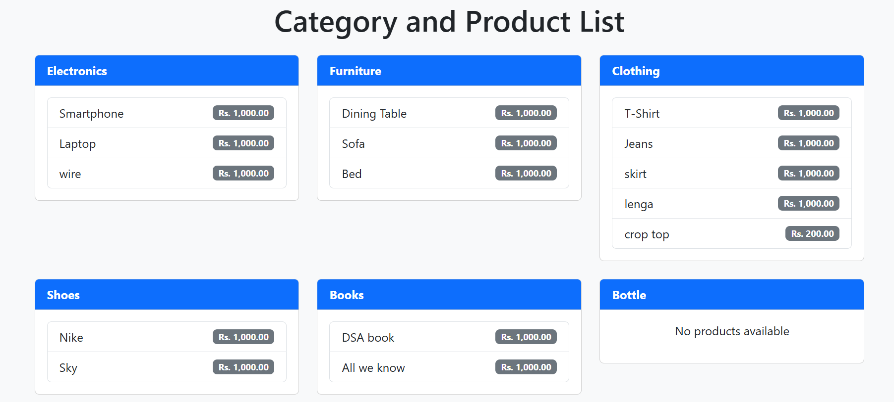

# 🛒 E-Commerce Website

A simple e-commerce web application built with HTML, CSS, PHP, and JavaScript. It includes both customer and admin features like product listing, cart, and category management.

---

## 🚀 Features

- Customer registration and login
- Admin login and dashboard
- Add, view, and manage products and categories
- Shopping cart and wishlist system
- Organized pages for customers and admins

---

## 🧩 Technologies Used

- **Frontend**: HTML, CSS, JavaScript
- **Backend**: PHP
- **Database**: SQLite or MySQL (configurable in `db_connection.php`)

---

## 📂 Project Structure

E-Commerce/
├── css/ # CSS styles
├── js/ # JavaScript scripts
├── images/ # Screenshots folder
├── add_category.html
├── add_product.php
├── admin.html
├── administrator.php
├── config.php
├── customer.php
├── db_connection.php
├── index.html
├── list.php
├── move_to_cart.php
├── product_management.db
├── product_success.php
├── remove_from_cart.php
├── remove_from_wishlist.php
├── user.php
└── README.md

---

## 📸 Screenshots

### 🏠 Home Page

### 👤 Admin Login

### ⚙️ Product Management Panel

### ➕ Add Product

### 🧾 Add Category

### 👥 Customer Login

### 🛍️ Customer Dashboard

### 🛒 Cart & Wishlist

### 🔍 View Product

---

## 🔧 How to Run

1. Download or clone this repository.
2. Place the project folder into your local server directory (e.g., `htdocs` for XAMPP).
3. Start Apache and MySQL (or configure SQLite if used).
4. Import or configure your database using `db_connection.php`.
5. Open `index.html` in a browser to start the site.

---

## 📝 Notes

- You can improve this project by adding session management, form validation, security features, or payment integration.
- Make sure to adjust file paths and database settings according to your environment.

---

## 📄 License

This project is free to use for learning and development purposes.
